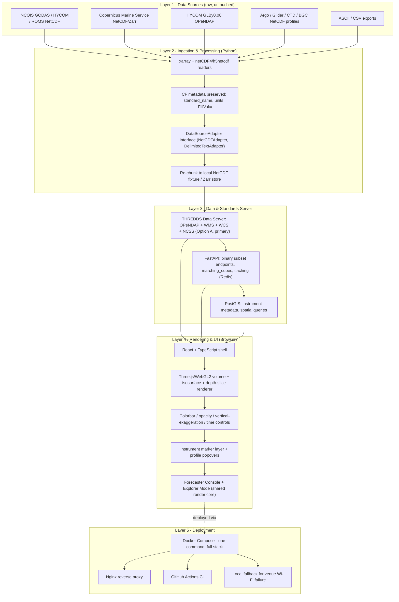
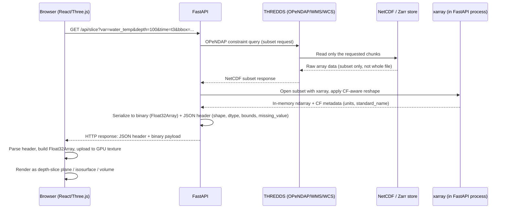
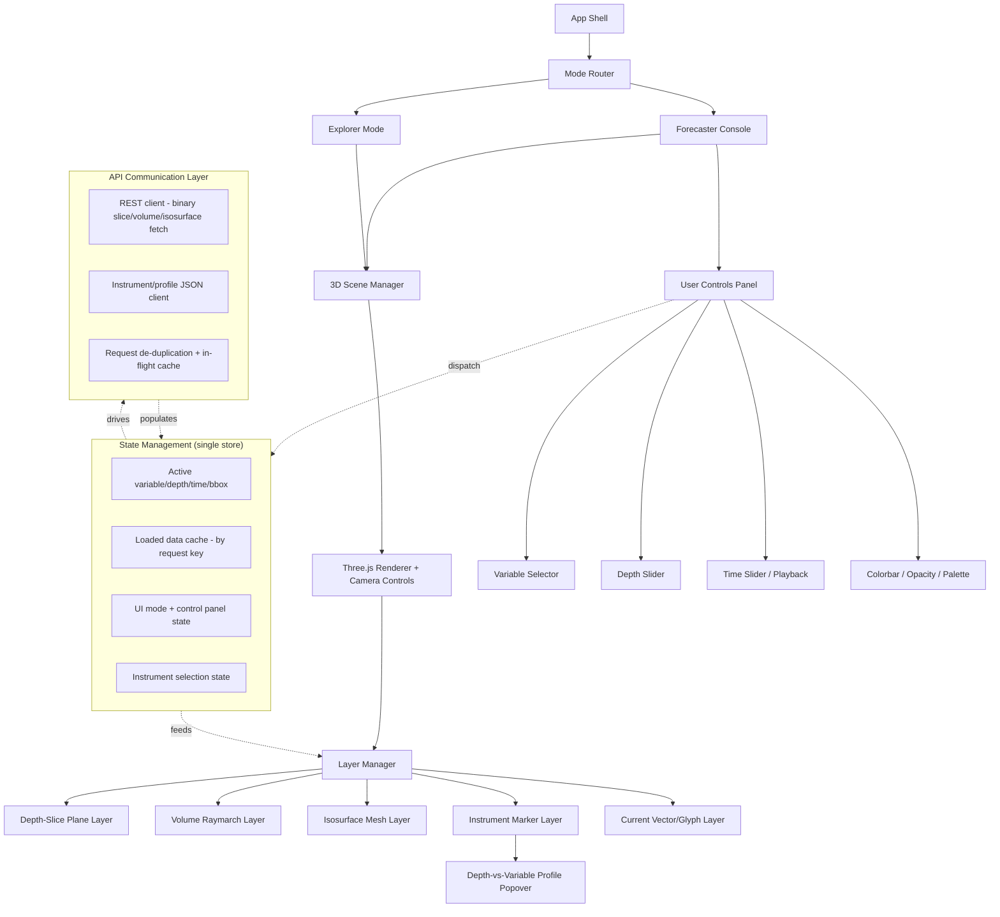

# TARANG - Web-Based Interactive 3D Ocean Visualization Platform

**Smart India Hackathon 2026 · Problem Statement 26067**
**Sponsor: Ministry of Earth Sciences (MoES) / INCOIS · Category: Software · Theme: Smart Automation**
**Official PS portal:** https://sih.gov.in/sih2026PS (resolve the live PS text and any attached datasets here before build day - portals change without notice)

This document is the single build reference for the team. It merges three research passes (data-source audit, execution-plan draft, and strategy blueprint) into one authoritative source of truth. If a decision here conflicts with something someone remembers from an earlier conversation, this document wins unless the PS text itself has changed.

---

## 0. How to Use This Document

- **Sections 1–4** decide *what* we build and *why*. Read these before writing code.
- **Sections 5–10** are the technical reference to keep open during the build (architecture, data path, backend contract, frontend component design).
- **Sections 11–13** are execution mechanics (roles, hour-by-hour plan, feature tiers).
- **Section 14** is the ML scope boundary - read this before anyone proposes "let's train a model."
- **Sections 15–18** are deployment, demo prep, risk, and citations.
- **Section 20** is written specifically for coding agents (Claude Code, Cursor, Copilot, etc.) picking up a task from this repo without a human re-explaining context.

**Non-negotiable rule for the whole team:** nothing goes on a pitch slide or in a demo claim that isn't actually running in the app. A smaller, fully-working claim beats a bigger, half-working one the moment a judge asks to see it live.

---

## 1. The Mandate - What INCOIS Actually Asked For

The PS asks for a browser-native, standards-compliant 3D visualization platform that fuses INCOIS ocean-model output (temperature, salinity, currents, chlorophyll) with in-situ instrument data (Argo floats, Gliders, CTD, BGC sensors), serving two audiences at once:

1. **Operational forecasters** - need rigorous, standards-compliant tooling (OGC WMS/WCS, CF Conventions, OPeNDAP).
2. **Students, general public, policymakers** - need an intuitive, story-driven experience ("public outreach / science communication" is named as a real deliverable, not a bonus slide).

### Do not get distracted by these three traps

| Trap | Why it costs you | The fix |
|---|---|---|
| Building "Google Earth with dots" | INCOIS already runs **Digital Ocean** (do.incois.gov.in, live since Dec 2020) which does 3D/4D visualization + data fusion. A naive re-build looks uninformed. | Name the gap explicitly in the pitch (§3.1). Differentiate on depth-resolved volumetric rendering + real OGC endpoints + a demoed plugin architecture. |
| Skipping OGC WMS/WCS + CF Conventions | These are named explicitly in the PS. Skipping them is a direct requirement miss, not a nice-to-have. | Implement at minimum a working `GetMap` and `GetCoverage` call (§9), or delegate to THREDDS (§4). |
| Treating "public outreach" as a bonus slide | It's a named deliverable in the "Expected Solution." | Ship a second UI mode (Explorer / guided view) from the same rendering core (§10). |

---

## 2. Requirement → Feature Map

Every line in the PS's "Expected Solution" is a scoring criterion. Judges will check the prototype against this list item by item.

| PS Requirement | Concrete Feature | Tier |
|---|---|---|
| 3D volumetric rendering of temperature/salinity/currents, depth-resolved | WebGL2 volume renderer (ray-march or texture-slab) over a regional NetCDF/Zarr subset, with a depth-slice plane view as guaranteed fallback | **MVP** |
| Depth-slice views, isosurface extraction, time-step animation | Depth scrubber slider, marching-cubes isosurface toggle, play/pause/scrub timeline with pre-fetched frame cache | **MVP** |
| Argo/Glider/CTD/BGC overlay + click-to-inspect profiles | Geospatial marker layer with real positions + popover depth-vs-variable chart from real float data | **MVP** |
| Multi-format ingestion (NetCDF, ASCII) | Adapter-pattern ingestion: `NetCDFAdapter` (xarray) + `DelimitedTextAdapter` (pandas) behind one interface | **MVP** |
| Customizable colorbar & variable controls | Palette picker, min/max range, log/linear toggle, opacity slider, vertical-exaggeration slider | **MVP** |
| Web-based, scalable, REST/OPeNDAP backend, no client install | FastAPI, Dockerized, binary-array REST endpoints + OPeNDAP-style subset endpoint | **MVP** |
| Extensible design for new sensors/variables | `DataSourceAdapter` + `LayerPlugin` interfaces driven by a YAML/JSON manifest, demoable live on stage | **Should-have** |
| OGC WMS/WCS, CF Conventions interoperability | `WMS GetMap` tile endpoint + `WCS GetCoverage` subset endpoint; CF `standard_name`/`units` carried end-to-end | **Differentiator** |
| Public outreach / science communication | "Explorer Mode": guided camera flythroughs, plain-language captions, multilingual UI shell | **Differentiator** |

This table is the contract. If a feature isn't in this table, it's out of scope until every MVP row is done.

---

## 3. Prior Art - Study This Before Writing Code

Citing prior art correctly is the fastest, cheapest way to look like domain experts instead of a generic hackathon team. This costs pitch time, not build time.

### 3.1 INCOIS Digital Ocean (do.incois.gov.in) - live since Dec 2020

INCOIS's own launch materials describe it as facilitating **"3D and 4D (3D in space with time animation) data visualization, data analysis, data fusion and multi-format download."** Ignoring this invites the obvious judge question: *"how is this different from what you already built?"*

- **Likely gap 1:** Digital Ocean reads as a broad GIS-style integration/download portal, not a purpose-built depth-resolved volumetric renderer with isosurface extraction. The PS re-asking for volumetric 3D suggests this is still open.
- **Likely gap 2:** No public evidence of OGC WMS/WCS + CF-compliant interoperable endpoints, or a plugin architecture for third-party sensors - both explicitly requested here.
- **Positioning line for the pitch:** *"We studied Digital Ocean. Here is the specific gap we close."*
- **Action item (Phase 0, someone owns this):** open do.incois.gov.in yourselves and confirm current state before the pitch is finalized.

### 3.2 pyParaOcean (IISc Bangalore, EnvirVis 2023)

Jain, Singh, Boda, Singh, Hotz, Vinayachandran, Natarajan - *"pyParaOcean: A System for Visual Analysis of Ocean Data,"* EnvirVis@EuroVis 2023. DOI: 10.2312/envirvis.20231100. Paper: https://arxiv.org/abs/2309.14328

A real, published ParaView desktop plugin built specifically for Bay of Bengal analysis (region 75°E–96°E, 5°S–30°N, depth to 200 m), covering:

- Isovolume / volume rendering of temperature & salinity
- Mesoscale eddy identification via the **Okubo–Weiss** criterion on the velocity field
- Surface-front tracking for high-salinity water-mass movement
- A "depth-profile needle" tool - drop a pin, get a full depth-vs-variable profile

Its follow-up, *"A Scalable System for Visual Analysis of Ocean Data"* (arXiv: https://arxiv.org/abs/2501.05009), describes a client / data-server / render-server split - a useful architectural reference for our own three-tier split.

**Use this as:** the strongest domain-accuracy reference. Porting the Okubo–Weiss eddy filter (§14) is the single feature most likely to make an INCOIS scientist on the panel sit up, because it's their own field's research running in a browser.

### 3.3 Other reference systems

| System | What it is | Takeaway |
|---|---|---|
| VAPOR (NCAR) | GPU-accelerated volumetric visualization for earth/ocean science, desktop-only | Validates GPU volume rendering as the right technique; we move it to WebGL |
| FloatChat - SIH 2025, PS 25040 (also MoES/INCOIS) | Conversational AI interface for Argo data discovery | A sibling INCOIS PS from last year. Mentioning ecosystem-fit ("our data layer could later feed a FloatChat-style query interface") signals you understand INCOIS's broader digital strategy |
| COVE, RedSeaAtlas, OceanPaths (academic) | Web-based collaborative ocean visual-analysis tools | Confirms web-based ocean visual analysis is an active, credible research area, not a fringe idea |
| Qin, Feng, Xu, Zhou, Liu, Li - *"Web-based 3D visualization framework for time-varying and large-volume oceanic forecasting data using open-source technologies"* (2020) | Peer-reviewed, open-source, browser-based volumetric rendering reference. Repo: https://github.com/qinrufu/Web-based-3D-visualization-of-oceanic-forecasting-data (HTML5/JS + Node.js + a .NET C# component) | Study the volume-rendering technique and adapt it; **do not copy wholesale** - the ingestion/instrument-overlay/standards work around it is our own build. Verify repo license before reusing any code directly (Phase 0 action item) |
| Three.js `webgl2_materials_texture3d` official example (mrdoob/three.js) | Canonical MIP + isosurface raymarching example with colormaps and contrast limits | Fallback / alternative rendering base if the Qin repo's data format doesn't fit our pipeline cleanly |
| Will Usher - "Volume Rendering with WebGL" tutorial | Reference raymarching + transfer-function implementation | Secondary shader reference |

> **Before you pitch:** re-open do.incois.gov.in and sih.gov.in/sih2026PS yourselves. Platforms change; this document is a strategy map, not a substitute for checking the live source.

---

## 4. Architecture Decision - Read This Before Touching the Backend

The three research passes that produced this document did **not** converge on one backend architecture. That disagreement matters enough to resolve explicitly here instead of leaving two half-built systems.

**Option A - THREDDS Data Server (TDS) as the compliance layer.**
Stand up `unidata/thredds-docker`, point it at local + remote NetCDF, and get OPeNDAP/WMS/WCS/NCSS for free via TDS's native `ncWMS`/Godiva3 bundle. FastAPI sits in front of TDS for app-specific binary responses; the OGC compliance claim is backed by a real, spec-correct server, not a hand-rolled approximation.

**Option B - Hand-rolled minimal WMS/WCS over a Zarr store.**
Skip TDS entirely. Ingest NetCDF via xarray, re-chunk into Zarr for fast random access, and implement just the specific `GetMap` and `GetCoverage` calls the frontend actually issues, directly in FastAPI.

### Recommendation: **Option A (THREDDS) as primary, Option B as the documented fallback**

I disagree with defaulting to the hand-rolled path, and here's the reasoning: a hand-rolled `GetMap`/`GetCoverage` that only implements the two calls your own frontend happens to make is not OGC compliance, it's an OGC-shaped API that will only look correct until a judge who knows the spec opens it in QGIS or asks for a capabilities document you didn't build. TDS gives you the real thing, with a documented, versioned, Docker-deployable release (**TDS v5.9**, released July 13 2026; requires Java 17 + Jakarta EE 9+, e.g. Tomcat 10), for zero custom protocol code. The actual risk in Option A is deployment friction, not compliance risk - Java version mismatches, catalog.xml misconfiguration, or a team unfamiliar with TDS burning Phase 0 hours on infrastructure instead of features.

**De-risking rule:** attempt Option A first, in Phase 0, against one local NetCDF fixture. Set a hard checkpoint - if OPeNDAP + WMS aren't both returning data locally within the first 4 hours, fall back to Option B for the rest of the build and be honest about it in the pitch ("we implement the two OGC calls our system actually needs" is still a legitimate, defensible claim - just a smaller one). Do not attempt both in parallel; that splits backend effort across two incompatible standards implementations.

Everything downstream in this document (§7, §9) is written for **Option A as primary**, with Option B endpoint shapes noted inline as the fallback.

---

## 5. System Architecture

Five layers, data flowing bottom-to-top. Every layer must be swappable - that is what makes the "extensible design" requirement literally true instead of aspirational.



| Layer | Responsibility | Key components |
|---|---|---|
| 1. Data Sources | Raw inputs, untouched | INCOIS model NetCDF; HYCOM/Copernicus reanalysis; Argo/Glider/CTD/BGC NetCDF; ASCII exports |
| 2. Ingestion & Processing | Parse, validate, normalize, chunk | xarray + netCDF4/h5netcdf; CF attributes preserved; adapter interface per format |
| 3. Data & Standards Server | Serve slices, standards endpoints, cache | THREDDS (OPeNDAP/WMS/WCS/NCSS, Option A) or Zarr + hand-rolled WMS/WCS (Option B); FastAPI orchestration; Redis cache; PostGIS for instrument metadata |
| 4. Rendering & UI | Volumetric rendering, controls, dual UI | React + Three.js; ray-march/texture-slab shader; isosurface + depth-slice modes; Forecaster Console vs Explorer Mode sharing one render core |
| 5. Deployment | Packaging, reliability, demo resilience | Docker Compose; Nginx; CI; offline fallback video + local stack |

**Why this shape wins on standards:** Layer 2 captures CF metadata (`units`, `standard_name`, `valid_min/max`) exactly once, and it threads through every layer above without being re-typed anywhere in the frontend. Layer 3 exposing WMS/WCS on top of the *same* store that feeds the binary endpoints, rather than a parallel bespoke system, is what makes standards compliance cheap instead of a second project.

---

## 6. Technology Stack

Pin exact versions at build time - the oceanographic and WebGL ecosystems move fast, and version drift breaks a working build overnight.

| Concern | Choice | Version (as of this research) | Why |
|---|---|---|---|
| Frontend framework | React + TypeScript + Vite | - | Fast to build two coordinated UI shells |
| 3D / volumetric rendering | Three.js | **r184** (April 16 2026) | Full shader control for real volume rendering; `Data3DTexture` + `webgl2_materials_texture3d` example is the canonical starting point |
| Optional geospatial globe | CesiumJS | latest stable | Free coastline/EEZ context if time allows; presentation shell only, not the core renderer |
| GPU path (optional) | WebGPU via `WebGPURenderer` | production-ready since Three.js r171 (Sep 2025); Safari 26 added support | WebGL2 remains the **safe default for judge hardware** - treat WebGPU as opt-in only |
| Charts (depth profiles) | Plotly.js or Recharts/D3 | - | Depth-vs-variable profile popovers |
| Map/base layer (2D context) | Leaflet or deck.gl | - | Argo position overlay, 2D context view |
| Backend API | Python + FastAPI + uvicorn | - | Async, fast to stand up, natural fit with the Python geoscience stack |
| NetCDF processing | xarray + netCDF4 (>=1.6) / h5netcdf (>=1.8) | current 2025.x xarray line | Do **not** use PyNIO - unmaintained, no longer a valid xarray engine. Default engine order: netCDF4 > h5netcdf > scipy |
| OPeNDAP client | xarray (pydap/netCDF4 backend), Siphon (TDS catalog browsing) | - | Direct OPeNDAP URL opening + catalog discovery |
| Isosurface extraction | scikit-image `measure.marching_cubes` (`method='lewiner'`, the default) | - | Lewiner, Lopes, Vieira, Tavares (2003), *Journal of Graphics Tools* 8(2):1–15 - faster, resolves topological ambiguity, returns verts/faces/normals/values |
| Chunked storage (Option B) | Zarr | - | Cloud-native chunked reads; avoids re-reading whole NetCDF per request |
| Standards server (Option A) | THREDDS Data Server, `unidata/thredds-docker` | **TDS v5.9** (July 13 2026); requires Java 17 + Jakarta EE 9+ (Tomcat 10) | Native OPeNDAP/WMS(ncWMS/Godiva3)/WCS/NCSS, zero custom protocol code |
| Serialization | orjson/msgpack for JSON metadata; raw binary (Float32Array) for grids | - | Compact numeric wire format, not JSON arrays of floats |
| Caching | Redis | - | Hot depth/time slices cached so timeline scrubbing feels instant on stage |
| Instrument metadata | PostgreSQL + PostGIS | - | Real geospatial queries ("floats in this bounding box") |
| In-situ data client | argopy | **1.4.0** (Jan 5 2026); registers `xarray` engine `'argo'`; requires Python ≥3.11; **incompatible with xarray 2024.3.0–2025.6.1** - pin carefully | Region/float/profile queries returning xarray directly |
| Model data client (Copernicus) | `copernicusmarine` Python package | - | Free account required; confirmed working for temperature/salinity/currents on one grid (§7.3) |
| Containerization | Docker + docker-compose | - | One command reproduces the whole stack, on judges' laptops and your own |
| CI | GitHub Actions | - | Catches breakage before demo day |

---

## 7. Data Sources Catalogue

Prototype on public, no-login data; treat true INCOIS production feeds as integration targets. **INCOIS's ERDDAP is 2D satellite-only** - the real depth-resolved model output lives on its Live Access Server (THREDDS) and FTP, not ERDDAP.

| Source | What you get | Access | Format | Link |
|---|---|---|---|---|
| INCOIS-GODAS (MOM-4.0) | Depth-resolved T/S/SSH/currents, surface-to-bottom, daily, ~1-day delay, 2003–present | INCOIS Live Access Server (THREDDS 4.3.10) + FTP, free, no registration | NetCDF (CF) | `las.incois.gov.in/thredds/dodsC/`, `ftpser.incois.gov.in` |
| INCOIS-HYCOM / INDOFOS-ROMS | Operational Indian Ocean forecast (1/16° HYCOM nested in global 1/4°; ~9.2 km ROMS) | Public programmatic access limited - treat as **production integration target**, not demo data | NetCDF | via INCOIS |
| INCOIS ERDDAP | 2D satellite only: SST, ocean color, scatterometer wind, TMI | Free, no registration, no WCS | griddap/OPeNDAP/WMS | `erddap.incois.gov.in` (ERDDAP 2.30.0) |
| INCOIS Digital Ocean | The existing prior-art platform (§3.1) - study first | Web portal | - | `do.incois.gov.in` |
| **HYCOM GLBy0.08 expt_93.0** | Global 1/12°, 40 depth levels (0–5000 m): `water_temp`, `salinity`, `water_u`, `water_v`, `surf_el` | **Free, no registration.** Note: transient "file not found" during refresh windows | OPeNDAP, NetcdfSubset, WMS, WCS | `tds.hycom.org/thredds/dodsC/GLBy0.08/expt_93.0`; NCSS `ncss.hycom.org`; WMS `wms.hycom.org`; WCS `wcs.hycom.org` |
| **Copernicus Marine Service (CMEMS)** | Global analysis/forecast + reanalysis: T/S/currents/chlorophyll. **Confirmed working** for T/S/u/v on one grid via one authenticated API | Free account required | NetCDF/Zarr via `copernicusmarine` toolbox, also OPeNDAP/ERDDAP | `marine.copernicus.eu` |
| **Argo GDAC** (Ifremer / US GODAE) | Core PRES/TEMP/PSAL/CNDC profiles + BGC-Argo (chlorophyll, oxygen, nitrate, pH) | Free NetCDF, no registration. DOI: 10.17882/42182 | FTP/HTTPS/rsync, S3 (`s3://argo-gdac-sandbox`), ERDDAP, THREDDS. Python: **argopy** | `data-argo.ifremer.fr` |
| IOOS Glider DAC | Glider trajectory/profile NetCDF, CF Discrete Sampling Geometry | Free | ERDDAP (`gliders.ioos.us/erddap`) + THREDDS | `gliders.ioos.us` |
| INCOIS OMNI-RAMA buoys | Vertical T/S/current profiles to ~500 m + surface met/waves | Free outside EEZ, but INCOIS in-situ delivery generally routes through a **Data Requisition Form**. Fastest open route: NOAA/PMEL's own RAMA distribution | NetCDF/ASCII | `incois.gov.in/jointportal`; requisition: `services.incois.gov.in/portal/datainfo/drform.jsp` |
| NOAA OISST | SST reanalysis - lightweight demo dataset | Free | NetCDF | `ncei.noaa.gov` |
| xarray tutorial datasets | Small CF-compliant NetCDF for offline dev, no remote OPeNDAP hammering | Free | NetCDF | `xarray.tutorial.load_dataset` |

**Practical rule:** scope every demo pull to one manageable region (Bay of Bengal or Arabian Sea) so file sizes stay demo-friendly, and **cache every dataset used in the live demo locally before judging** - both HYCOM and Copernicus have documented outage/refresh windows, and venue Wi-Fi is not something to depend on.

---

## 8. The Complete Path: Scientific Data → Browser Pixel

This is the part every team member and every coding agent touching the backend or frontend needs to understand before writing a single endpoint.



### 8.1 NetCDF Anatomy - What You're Actually Reading

A CF-compliant ocean NetCDF file (HYCOM, Copernicus, INCOIS-GODAS) is structured as:

```
netcdf ocean_model_output {
dimensions:
    time = UNLIMITED ;   // e.g. 8 daily steps
    depth = 40 ;          // z-levels, non-uniform spacing
    lat = 850 ;
    lon = 1500 ;

variables:
    double time(time) ;
        time:units = "hours since 2000-01-01 00:00:00" ;
        time:calendar = "gregorian" ;
    float depth(depth) ;
        depth:units = "m" ;
        depth:positive = "down" ;
    float lat(lat) ;
        lat:units = "degrees_north" ;
    float lon(lon) ;
        lon:units = "degrees_east" ;
    float water_temp(time, depth, lat, lon) ;
        water_temp:units = "degC" ;
        water_temp:standard_name = "sea_water_temperature" ;
        water_temp:_FillValue = -30000.f ;
        water_temp:valid_min = -5.f ;
        water_temp:valid_max = 40.f ;
    float salinity(time, depth, lat, lon) ;
        salinity:standard_name = "sea_water_salinity" ;
    float water_u(time, depth, lat, lon) ;
    float water_v(time, depth, lat, lon) ;

// global attributes
    :Conventions = "CF-1.6" ;
    :title = "HYCOM GLBy0.08 expt_93.0" ;
}
```

| Concept | What it means for us |
|---|---|
| **Dimensions** | The axes of the data cube: `time`, `depth`, `lat`, `lon`. A depth-slice request fixes `depth` and `time`, leaving a 2D `(lat, lon)` array. A full-volume request leaves `depth` free too. |
| **Variables** | The actual physical fields: `water_temp`, `salinity`, `water_u`/`water_v` (currents), `surf_el` (sea surface height), chlorophyll (BGC). Each variable is indexed by some subset of the dimensions. |
| **Metadata (CF attributes)** | `units`, `standard_name`, `_FillValue`, `valid_min`/`valid_max`. This is what makes the colorbar show "°C" instead of a raw number, and what tells the renderer which cells are missing/land-masked. **Capture this once in the ingestion layer and thread it through - never hand-type units in the frontend.** |
| **Coordinate systems** | `lat`/`lon` in degrees (WGS84-equivalent for practical purposes); `depth` in meters, positive-down, and **non-uniform** (HYCOM's 40 levels run 0, 2, 4, 6, 8, 10, 12, 15, 20, 25, 30, 35, 40, 45, 50, 60, 70, 80, 90, 100, 125, 150, 200, 250, 300, 350, 400, 500, 600, 700, 800, 900, 1000, 1250, 1500, 2000, 2500, 3000, 4000, 5000 m). **The depth slider must snap to actual levels, not assume linear spacing.** |

### 8.2 Subsetting

Never load a whole global NetCDF/OPeNDAP dataset into memory. Every request from the frontend should map to an OPeNDAP constraint expression or an xarray `.sel()`/`.isel()` call that touches only the needed bytes:

```python
import xarray as xr

ds = xr.open_dataset(
    "https://tds.hycom.org/thredds/dodsC/GLBy0.08/expt_93.0",
    engine="netcdf4",  # or pydap for pure-OPeNDAP
)

subset = ds["water_temp"].sel(
    depth=100, method="nearest"
).sel(
    time=slice("2026-08-20", "2026-08-25")
).sel(
    lat=slice(5, 25), lon=slice(80, 100)  # Bay of Bengal bounding box
)
```

If serving via THREDDS (Option A), the equivalent constraint is expressed as an OPeNDAP URL suffix (`?water_temp[7][20][0:849][0:1499]`) or, more conveniently, via TDS's **NetCDF Subset Service (NCSS)**, which accepts a REST-style bounding box + variable + time query and returns a small subsetted NetCDF or CSV, no manual index math required.

### 8.3 OPeNDAP Access

OPeNDAP lets a client request only a slice of a remote dataset without downloading the whole file. TDS and HYCOM's `tds.hycom.org` both expose it natively. In practice:

- Browsing: use **Siphon** to walk the TDS catalog and discover dataset URLs programmatically.
- Reading: `xarray.open_dataset(opendap_url)` (via the `pydap` or `netCDF4` backend) opens it lazily - nothing is pulled over the wire until you `.sel()`/`.compute()`.
- Our FastAPI layer wraps this: client asks FastAPI for a slice, FastAPI translates it into an OPeNDAP-constrained xarray read, not a full-file download.

### 8.4 WMS / WCS

- **WMS (`GetMap`)** returns a rendered image tile for a given layer/bbox/time/style - useful for the 2D base-layer/context view and for external GIS clients (QGIS) to consume our layer directly.
- **WCS (`GetCoverage`)** returns the actual subsetted numeric coverage, not a picture - this is what a downstream system would use to pull real numbers.
- **Option A (THREDDS):** both are native, spec-correct, and bundled (`ncWMS`/Godiva3 for WMS). No custom code.
- **Option B (hand-rolled):** implement exactly the `GetMap` and `GetCoverage` calls your own frontend and one external client actually use, over the Zarr store. This is a legitimate, defensible claim of partial OGC support - just be precise about scope in the pitch, don't imply full spec coverage.

### 8.5 Server-Side Transformation

- **Isosurfaces:** `skimage.measure.marching_cubes(volume, level=threshold)` → returns `verts`, `faces`, `normals`, `values`. Serialize `verts`/`faces`/`normals` as flat `Float32Array`/`Uint32Array` buffers for direct upload into a Three.js `BufferGeometry` - do not round-trip through JSON arrays of numbers.
- **Depth slices:** a 2D `(lat, lon)` array at fixed depth/time → textured plane.
- **Full volume (for raymarching):** a 3D `(depth, lat, lon)` array → Three.js `Data3DTexture`.

### 8.6 Backend Response Wire Format

Numeric grids travel as **binary**, not JSON-encoded float arrays - a `(40, 850, 1500)` float32 volume is ~200 MB as raw bytes and would balloon by 3–5x as JSON text.

```
HTTP Response:
  Header (small JSON, sent first or as a custom header):
    {
      "shape": [40, 850, 1500],
      "dtype": "float32",
      "variable": "water_temp",
      "units": "degC",
      "standard_name": "sea_water_temperature",
      "missing_value": -30000.0,
      "bounds": {"depth": [0, 5000], "lat": [5, 25], "lon": [80, 100]},
      "depth_levels": [0, 2, 4, 6, 8, ...]   // non-uniform, explicit
    }
  Body:
    raw Float32Array bytes, row-major, matching "shape"
```

Use `orjson`/`msgpack` for the header and raw bytes (or a `multipart` response, or a custom binary framing with a fixed-size header prefix) for the payload. This is the single most important performance decision in the whole backend - get it wrong and the 3D view will stutter no matter how good the shader is.

### 8.7 Frontend Consumption

```javascript
const res = await fetch(`/api/slice?var=water_temp&depth=100&time=t3`);
const buffer = await res.arrayBuffer();
// header parsed from a companion request or a length-prefixed frame
const floatArray = new Float32Array(buffer);

const texture = new THREE.DataTexture(
  floatArray, shape[2], shape[1], THREE.RedFormat, THREE.FloatType
);
texture.needsUpdate = true;
// feed into the depth-slice plane material or the 3D texture for raymarching
```

CF metadata from the header drives the colorbar labels, units, and valid-range clamping directly - this is the payoff of preserving CF attributes all the way from Layer 2.

---

## 9. Backend API Contract

| Endpoint | Protocol | Returns | Notes |
|---|---|---|---|
| `GET /api/metadata?source=hycom` | Custom REST (JSON) | Available variables, dims, CF units, depth levels, time range | Drives the frontend's variable/depth/time selectors |
| `GET /api/slice?var=&depth=&time=&bbox=` | Custom REST (binary, §8.6) | Float32Array for a depth-slice plane | Fastest path for the 2D-in-3D view |
| `GET /api/volume?var=&time=&bbox=` | Custom REST (binary) | Float32Array for the full depth column (raymarching input) | Larger payload - cache aggressively |
| `GET /api/isosurface?var=&threshold=&time=&bbox=` | Custom REST (binary) | `verts`/`faces`/`normals` from `marching_cubes` | Server-side compute, cache by `(var, threshold, time, bbox)` key |
| `GET /api/instruments?bbox=&type=argo|glider|ctd|bgc` | Custom REST (JSON) | Positions + platform IDs within a bounding box | Backed by PostGIS |
| `GET /api/profile?platform_id=&time=` | Custom REST (JSON) | Depth-vs-variable arrays for one float/profile | Powers the click-to-inspect popover |
| `/thredds/dodsC/...` (Option A) or `/opendap/...` (Option B) | OPeNDAP | Standard OPeNDAP subset access | The literal "REST/OPeNDAP" requirement in the PS |
| `/wms?SERVICE=WMS&REQUEST=GetMap&LAYERS=...` | OGC WMS | Rendered tile image | Native via TDS (Option A) or hand-rolled (Option B) |
| `/wcs?SERVICE=WCS&REQUEST=GetCoverage&COVERAGE=...` | OGC WCS | Subsetted coverage array | Native via TDS (Option A) or hand-rolled (Option B) |

### Plugin / Extensibility Registry

A YAML manifest is the actual implementation of the "plugin-style extensible" requirement - new sensors or variables are added as registry entries, not new code paths. This is what gets edited live on stage in the demo (§16).

```yaml
# registry/hycom_water_temp.yaml
id: hycom_water_temp
label: "HYCOM - Water Temperature"
adapter: NetCDFAdapter
source: "https://tds.hycom.org/thredds/dodsC/GLBy0.08/expt_93.0"
variable: water_temp
standard_name: sea_water_temperature
units: degC
colormap: viridis
render_type: volume        # volume | slice | isosurface | vector
depth_levels: [0, 2, 4, 6, 8, 10, 12, 15, 20, 25, 30, 35, 40, 45, 50,
                60, 70, 80, 90, 100, 125, 150, 200, 250, 300, 350, 400,
                500, 600, 700, 800, 900, 1000, 1250, 1500, 2000, 2500,
                3000, 4000, 5000]
```

Adding a new sensor = adding a new YAML file + a catalog entry (Option A) or a Zarr path (Option B). **No frontend or backend code changes required** - this is the claim you prove live.

For a sensor that needs custom ingestion logic, add an adapter plugin without changing the
registry loader. A plugin module can expose a `register_plugin(register_adapter)` function and
register one or more `DataSourceAdapter` subclasses:

```python
from backend.app.plugins import register_adapter

def register_plugin(register=register_adapter):
    register("MySensorAdapter", MySensorAdapter)
```

Load local plugin modules with a comma-separated `TARANG_PLUGIN_MODULES` environment variable.
Packaged integrations can instead publish Python entry points in the `tarang.adapters` group;
the entry point may resolve to an adapter class, a `{name: class}` mapping, or a registration
function. The YAML `adapter` value is the only connection to the rest of the API, so metadata,
slice, volume, WMS, and WCS routes remain unchanged.

---

## 10. Frontend / Component Architecture

The frontend is one shared rendering core wrapped by two UI shells (Forecaster Console, Explorer Mode). Structure it so a coding agent can open any one concern below and know exactly which files own it.



### State management
One central store (Zustand or Redux Toolkit; avoid prop-drilling through the 3D scene). It holds: active variable/depth/time/bbox selection, the data cache keyed by request signature (`var:depth:time:bbox`), current UI mode (Console/Explorer), and instrument selection state. The 3D scene subscribes to this store and re-renders only the layers whose inputs changed - never re-fetch or re-upload a texture that hasn't actually changed.

### API communication
A thin typed client wrapping `fetch`, one function per endpoint in §9. Binary responses (`slice`, `volume`, `isosurface`) go through a shared parser that reads the header + `Float32Array` body (§8.6/8.7). Add request de-duplication: if the depth slider fires 10 events while dragging, only the last settled value should trigger a network call (debounce), and an in-flight request for the same key should be reused, not duplicated.

### 3D scene management
One `THREE.Scene`, one `THREE.PerspectiveCamera` with `OrbitControls`, one `WebGLRenderer` (WebGL2 context). The scene owns a `LayerManager` (below) rather than components each independently touching the renderer. Camera state (position, target) is part of the Explorer Mode's guided-flythrough scripting.

### Rendering lifecycle
`mount → fetch initial slice → build geometry/texture → render loop (requestAnimationFrame) → on state change: diff which layer needs new data → fetch → update texture/geometry in place (never rebuild the whole scene) → unmount → dispose geometries/textures/materials explicitly (WebGL leaks are real and will kill a 36-hour-old demo on hour 30)`.

### Data loading
Every layer's data request goes through the API layer's cache-aware client. On mode switch (Console ↔ Explorer) or region change, cancel in-flight requests for the old bbox before issuing new ones (`AbortController`).

### Layer management
`Layers` is a registry keyed by the YAML manifest's `id` (§9). Each layer type (`slice`, `volume`, `isosurface`, `marker`, `vector`) implements a common interface: `load(params) → build() → update(params) → dispose()`. Adding a new layer type for a new sensor is how the live plugin demo (§16) is implemented on the frontend side.

### User controls
Variable selector, depth slider (snapping to actual non-uniform depth levels, §8.1 - never assume linear spacing), time slider with play/pause/scrub, colormap picker, min/max range, log/linear toggle, opacity, vertical-exaggeration. All controls dispatch to the central store; nothing touches Three.js objects directly.

### Performance considerations
- Debounce slider-driven fetches (150–300ms).
- Reuse `THREE.DataTexture`/`Data3DTexture` objects in place (`texture.image.data = newFloatArray; texture.needsUpdate = true`) instead of allocating a new texture per frame change.
- Dispose every geometry/material/texture on layer teardown.
- Keep the isosurface mesh vertex count bounded - downsample the source grid before `marching_cubes` if the region is large (see LOD below).

### Large dataset handling
Never send a full global grid to the browser. Every request is bbox-scoped server-side (§8.2). For the volume/raymarch layer, cap the texture resolution to what the demo GPU can hold (e.g. downsample a `(40, 850, 1500)` regional cube to a browser-safe resolution before serialization) and offer a "full resolution" toggle only for the depth-slice view, which is far cheaper.

### Progressive loading
Load a coarse version of the volume first (heavily downsampled), render it immediately, then fetch and swap in the full-resolution version in the background. This is both a genuine answer to the PS's "scalable architecture" requirement and a real story: INCOIS's own mandate includes advisories to coastal fisherfolk over patchy connectivity, so bandwidth-aware progressive delivery is not just a performance trick, it maps to a real operational constraint.

### Level of detail (LOD)
Three tiers, selected by camera distance and/or an explicit user toggle:
1. **Overview LOD:** coarse downsampled volume or a flat 2D WMS tile - fast, always available, used for the Explorer Mode flythrough.
2. **Working LOD:** the standard regional subset at native or lightly-downsampled resolution - the default Forecaster Console view.
3. **Detail LOD:** full-resolution subset for a small bbox, requested explicitly (e.g. "inspect this eddy") - never the default, always opt-in given the payload size.

---

## 11. Team Structure (6-Person Model)

Reconciled across all three planning passes. If your team is smaller, merge roles top-to-bottom (Lead absorbs Presentation; DevOps absorbs Backend) rather than dropping a role outright - each one maps directly to a block of §2's requirement table.

| Role | Owns | Core skills |
|---|---|---|
| **Team Lead / Product Owner** | Scope control against §2, timeline enforcement, final MoSCoW call, judge Q&A quarterbacking | Prioritization, enough full-stack fluency to judge feasibility fast |
| **Data & Backend Engineer** | Ingestion adapters, xarray pipeline, FastAPI slice/isosurface/instrument endpoints, OPeNDAP/WMS/WCS layer, THREDDS deployment (§4) | Python, xarray/netCDF4, FastAPI, Docker |
| **3D / Graphics Engineer** | Volume shader (raymarch or texture-slab), isosurface + depth-slice modes, render performance, LOD | WebGL2/GLSL, Three.js, linear algebra |
| **Frontend / UX Engineer** | React app shell, Console + Explorer UI, control panel, profile-chart popovers, state management | React, TypeScript, D3/Recharts/Plotly, interaction design |
| **Instrument Data & Charting** | Argo/glider/buoy position + profile queries via argopy, depth-vs-variable charts, model-vs-observation overlay | argopy, pandas, React charting, oceanographic data literacy |
| **DevOps / Infra + Demo Lead** | Docker Compose, Redis/PostGIS wiring, CI, offline fallback, deployment, documentation, demo/video prep | Docker, Nginx, CI/CD, technical writing |

**Optional 7th/8th member or mentor focus:** implement the Okubo–Weiss eddy-detection stretch feature (§14) as a self-contained backend filter that never blocks the MVP path. Two mentor tracks are useful if available: one technical (architecture/code review), one domain/pitch (stress-tests the demo script and Q&A prep against real INCOIS terminology).

---

## 12. Execution Roadmap

### Phase 0 - Pre-Hackathon Prep (1–2 weeks before, or your entire runway if this is an internal round)

- Lock §2's requirement→feature map and §13's MoSCoW list as a team - no re-litigating scope once the clock starts.
- **De-risk the highest-uncertainty item first:** attempt THREDDS (Option A, §4) against one local NetCDF fixture. Hard checkpoint at 4 hours - OPeNDAP + WMS both returning data locally, or fall back to Option B for the whole build.
- In parallel: clone the Qin et al. repo (§3.3), get its demo running, inspect exactly what input format `VolumeViewer` expects, and check for a LICENSE file - this decides whether you reuse code directly or reimplement the technique.
- Install `argopy`, pull one small real Argo sample for the Bay of Bengal / Arabian Sea, document its structure.
- Test-pull Copernicus Marine T/S/currents and the BGC (chlorophyll) dataset separately - confirm both dataset IDs.
- Pre-download and lightly pre-process real Argo + one reanalysis dataset for the target region, so hour 1 of the real build isn't spent fighting venue Wi-Fi.
- Wireframe both UI modes; get the repo, Docker skeleton, and CI green before day one.
- Draft the pitch narrative and the prior-art slide (§3) - these don't depend on the code being finished.

### Phase 1 - The Data Contract (blocks everything downstream)

One person owns this, decided at the Phase 0 checkpoint. Until it exists, no one can safely build rendering or backend against a stable shape.

- Using the now-confirmed real structures (model grid + Argo profile), write the API contract (§9): what a "get model field" request/response looks like, what an "instrument profile" object looks like.
- Carry CF metadata (`standard_name`, `units`, `long_name`) through the contract so the frontend colorbar shows correct labels for free.
- Circulate for a 30-minute sign-off, especially from whoever builds rendering - they consume this shape directly.

**Rushing past this phase causes the most expensive rework later. Do not skip it under time pressure.**

### Phase 2 - Core Pipelines (parallel, after Phase 1 sign-off)

| Track | Owner | Work |
|---|---|---|
| 1. Rendering | 3D Engineer | Adapter: NetCDF (via xarray) → renderer input format (new glue code, informed by Qin et al., not copy-paste). One variable (temperature) rendering as a static depth-slice with real data. Add time-step animation. Add salinity + currents as vector/particle overlay. |
| 2. Backend | Data & Backend Engineer | FastAPI serving region/depth/time/variable subsets per the Phase 1 contract. Argo ingestion endpoint via argopy. Cache demo regions/dates locally so the live demo never depends on an external API call. |
| 3. Instrument overlay & charts | Instrument Data Engineer | Marker layer plotting Argo/Glider positions. Click-to-profile chart (Plotly, following the Qin repo's charting approach where useful). Wire to Track 2's Argo endpoint. |
| 4. Infrastructure | DevOps | Docker Compose wiring frontend + backend. Deploy an early, ugly version - surface deployment problems now, not on the last day. Repeatable CI. |

### Phase 3 - Integration (sequenced, needs Phase 2 pieces working)

- Wire rendering (Track 1) to backend (Track 2) - real data flowing end-to-end, not test files.
- Wire the instrument overlay (Track 3) into the same scene as the volumetric render.
- Add colorbar, variable selector, depth/time sliders on top of the working render.
- First full end-to-end test: pick a region, pick a date, click a float, watch it all work together.

**This is where schema mismatches surface. Budget real time for it - it is not a quick final-day check.**

### Phase 4 - Differentiators (the requirements a reference repo doesn't cover)

- Isosurface extraction (`marching_cubes`) - add once core rendering is stable; it's the single highest-risk feature.
- Extensibility proof - the YAML manifest (§9) adding a new source with zero code change, demoable live on stage.
- Minimal WMS/WCS + CF passthrough - an explicit PS requirement almost every other team skips.
- Outreach / Explorer Mode - named in the PS as a real deliverable.

### Phase 5 - Demo Preparation (last)

- Cache all demo-day data locally - nothing depends on live external APIs during judging.
- Rehearse the demo script (§16), timed, more than once.
- Record a fallback demo video in case the live demo fails.
- Finalize submission materials (architecture diagram, pitch), written to reflect what was actually built, not what was planned.

### Hour-by-Hour Reference (36-hour Grand Finale format)

| Phase | Hours | Exit criterion |
|---|---|---|
| 1 - Foundation | 0–8 | One real depth-slice renders end-to-end on screen |
| 2 - Core build | 8–20 | A judge can rotate a real 3D field, click a real float, and scrub time |
| 3 - Differentiators | 20–28 | Standards endpoints respond correctly; both UI modes are navigable |
| 4 - Hardening | 28–34 | App survives a cold reload and a network drop without crashing |
| 5 - Demo prep | 34–36 | Every claim on a slide has a corresponding working feature |

---

## 13. Feature Prioritization (MoSCoW) - The Non-Negotiables

| Tier | Features |
|---|---|
| **Must have (MVP - submission is incomplete without these)** | Real-data depth-slice + basic volumetric render of at least one variable; Argo marker overlay with click-to-inspect profile chart; colorbar + variable/opacity/vertical-exaggeration controls; time-step animation; one-command Dockerized deploy |
| **Should have** | Isosurface-extraction toggle; two working ingestion adapters (NetCDF + ASCII) shown explicitly; minimal WMS-style endpoint |
| **Could have** | WCS endpoint; live on-stage plugin-add demo; full Forecaster/Explorer dual UI; multilingual Explorer Mode copy |
| **Won't have this cycle** | ML-based forecasting; native mobile app; multi-user auth/roles; full offline-first PWA |

If a feature isn't in "Must have" or "Should have" and the clock is inside the last 8 hours, it does not get built. The Team Lead holds sole veto power on new scope (§11).

---

## 14. Scope for ML - Read the Boundary Before Proposing Anything

The PS does **not** ask for a new forecasting model, and building one is explicitly out of scope for this cycle (§13, "Won't have"). The legitimate ML/algorithmic surface for this project is narrow and specific:

### In scope (stretch, self-contained, must never block the MVP path)

1. **Okubo–Weiss eddy detection** (from pyParaOcean, §3.2) - a deterministic vorticity/strain-rate filter on the current-vector field (`water_u`/`water_v`), not a trained model. Computed server-side, returned as a highlighted region overlay. This is the single feature most likely to read as genuine domain sophistication to an INCOIS scientist on the panel, because it's a real technique from published research, not a demo gimmick.
2. **Surface-front / water-mass tracking** (also pyParaOcean) - same category: a deterministic algorithmic filter on salinity/temperature gradients, not a trained model.
3. **Model-vs-observation delta** - a simple numeric comparison (not ML) between the nearest model grid cell and a real Argo profile at the same location/time, surfaced as a diagnostic overlay. Directly useful to the "operational forecaster" audience.

### Explicitly out of scope for this hackathon cycle

- Training any predictive/forecasting model (that's a different, much larger problem, and the PS does not ask for it).
- Any ML pipeline that requires a labeled training set, a training loop, or a model registry - there is no time budget for this in a 36-hour build, and it would compete directly with the MVP's build hours.
- Presenting deterministic algorithmic filters (Okubo–Weiss, gradient tracking) as "AI" or "ML" in the pitch - they aren't, and a judge who knows the technique will notice the mislabeling immediately. Call them what they are: published oceanographic analysis techniques, ported to the browser.

### Where ML legitimately belongs in a *future* roadmap (mention only if asked "what's next")

- Eddy/front detection upgraded from a deterministic filter to a learned classifier trained on labeled historical altimetry, once a real dataset and evaluation protocol exist.
- Anomaly detection on the model-vs-observation delta stream (§14, item 3) to auto-flag likely sensor drift or model bias, given enough historical delta data to establish a baseline.
- A FloatChat-style (§3.3) natural-language query layer over the instrument data, as a genuinely separate follow-on project, not a feature of this one.

---

## 15. Deployment

- **Docker Compose** brings up the full stack (THREDDS/Zarr store, FastAPI, Redis, PostGIS, React build, Nginx) with one command. This must work on a judge's laptop, cold, with no pre-existing state.
- **Nginx** reverse-proxies the frontend build and API/OPeNDAP/WMS/WCS endpoints behind one origin, avoiding CORS complications during the demo.
- **CI (GitHub Actions):** build + basic smoke test (does the container start, does `/api/metadata` respond) on every push. Catch breakage before demo day, not during it.
- **Offline fallback:** every dataset used in the live demo is cached locally ahead of time (§7). Venue Wi-Fi failing during the live demo is a *when*, not an *if* - have a local Docker Compose fallback on the presenting laptop **and** a pre-recorded screen-capture backup video.
- **Version pinning table** (lock these before Phase 2 starts, re-verify at build time since these move fast):

| Component | Version pinned during this research |
|---|---|
| THREDDS Data Server | v5.9 (July 13 2026) - Java 17, Jakarta EE 9+/Tomcat 10 |
| Three.js | r184 (April 16 2026) |
| argopy | 1.4.0 (Jan 5 2026) - Python ≥3.11, **incompatible with xarray 2024.3.0–2025.6.1** |
| INCOIS ERDDAP | 2.30.0 |
| xarray | current 2025.x line |
| netCDF4 | ≥1.6 |
| h5netcdf | ≥1.8 |

---

## 16. Demo Script & Anticipated Judge Questions

### Suggested flow

1. Open in **Explorer Mode**: a ~20-second guided flythrough over the Bay of Bengal, immediate visual impact, no jargon.
2. Cut to the prior-art slide (§3): name Digital Ocean and pyParaOcean, state the specific gap closed, in under 30 seconds.
3. Switch to **Forecaster Console**: rotate a real volumetric temperature field, toggle isosurface mode, scrub the depth slider (watch it snap to real, non-uniform levels).
4. Click a real Argo float marker, show its live depth-vs-temperature/salinity profile chart.
5. **Live plugin demo:** add a new mock sensor source via the YAML manifest, on stage, in under two minutes, with zero code changes.
6. Close on the standards-compliance slide (WMS/WCS/CF), with a one-line roadmap for production handoff to INCOIS.

### Prepare for these questions

| Likely question | Answer angle |
|---|---|
| "How is this different from Digital Ocean?" | Name the specific gap from §3.1 - volumetric depth-resolved rendering + open-standards interoperability + a demoed plugin architecture, not just data integration and download |
| "Is this actually OGC-compliant, or are you just saying that?" | Show the live WMS/WCS request/response; if using THREDDS (Option A), this is a real, spec-correct server - say so plainly |
| "How does this perform on a large NetCDF file?" | Explain the chunking/subsetting strategy (§8.2) - only the requested chunk is ever read, never the whole file |
| "What happens on poor connectivity, e.g. a coastal advisory use case?" | Progressive LOD loading (§10) - coarse volume first, refine on demand; ties directly back to INCOIS's own fisherfolk-advisory mandate |
| "How would INCOIS actually deploy this in production?" | One-command Docker Compose today; point to the THREDDS/standards endpoints as the actual production integration surface |
| "Is the eddy detection AI?" | No, be precise: it's the Okubo–Weiss criterion, a deterministic technique from published oceanographic research (§3.2, §14), ported to run in the browser |

---

## 17. Risk Register

| Risk | Mitigation |
|---|---|
| THREDDS setup burns Phase 0 hours | Hard 4-hour checkpoint (§4); fall back to Option B and be honest about reduced OGC scope in the pitch |
| Volume ray-marching shader isn't finished in time | De-risked in Phase 0; depth-slice view is the guaranteed-to-work fallback and still satisfies the PS's literal "depth-slice views" requirement |
| Large NetCDF files are slow or crash the browser/backend | Pre-chunk/pre-subset ahead of time; cap the live-demo dataset to one regional subset (e.g. Bay of Bengal only) |
| Venue Wi-Fi fails during the live demo | Local Docker Compose fallback on the presenting laptop + a pre-recorded screen-capture backup video |
| Scope creep across a 6-person team | Strict MoSCoW (§13) with the Team Lead holding sole veto power on new scope |
| Judges unfamiliar with oceanography jargon | Explorer Mode's plain-language captions double as a 30-second glossary moment in the pitch |
| Dataset licensing/attribution issues | Use only open Argo GDAC, HYCOM, and Copernicus data (§7), with a visible attribution line in the app footer |
| argopy/xarray version incompatibility | Pin exact versions per §15's table before Phase 0 starts; do not upgrade mid-hackathon |
| HYCOM/Copernicus transient outages during judging | Cache all demo subsets locally; never rely on live external queries during the actual demo |

---

## 18. Open Source References, Publications & Dataset Links

### Publications
- Jain, Singh, Boda, Singh, Hotz, Vinayachandran, Natarajan - *"pyParaOcean: A System for Visual Analysis of Ocean Data,"* EnvirVis@EuroVis 2023. DOI: 10.2312/envirvis.20231100. https://arxiv.org/abs/2309.14328
- Same authors (follow-up) - *"A Scalable System for Visual Analysis of Ocean Data."* https://arxiv.org/abs/2501.05009
- Qin, Feng, Xu, Zhou, Liu, Li - *"Web-based 3D visualization framework for time-varying and large-volume oceanic forecasting data using open-source technologies"* (2020). Repo: https://github.com/qinrufu/Web-based-3D-visualization-of-oceanic-forecasting-data
- Lewiner, Lopes, Vieira, Tavares - *"Efficient implementation of Marching Cubes' cases with topological guarantees,"* Journal of Graphics Tools 8(2):1–15, 2003 (the algorithm behind `skimage.measure.marching_cubes`)

### Open-source projects to study
- Three.js `webgl2_materials_texture3d` official example (mrdoob/three.js) - canonical raymarching/isosurface volume renderer
- Will Usher - "Volume Rendering with WebGL" tutorial - raymarching + transfer-function reference
- VAPOR (NCAR) - GPU-accelerated volumetric visualization for earth/ocean science (desktop reference)

### Dataset Link Table (see §7 for full details)
| Dataset | Source URL | Access Format | 
|---|---|---|
| INCOIS Data Holdings | https://incois.gov.in/site/dataholdings.jsp | Web Portal |
| INCOIS Digital Ocean | https://do.incois.gov.in | Web Portal / REST API |
| HYCOM GLBy0.08 | https://tds.hycom.org | OPeNDAP / THREDDS |
| Copernicus Marine | https://marine.copernicus.eu | NetCDF Download / subset API |
| Argo GDAC (Ifremer) | https://data-argo.ifremer.fr | NetCDF FTP / argopy |
| NOAA OISST | https://www.ncei.noaa.gov | NetCDF / OPeNDAP |
| IOOS Glider DAC | https://gliders.ioos.us | ERDDAP / NetCDF |

### Official
- SIH 2026 portal: https://sih.gov.in/sih2026PS - **the authoritative source for the current PS text; re-check before final submission**

---

## 19. Glossary

| Acronym | Meaning |
|---|---|
| EEZ | Exclusive Economic Zone |
| INCOIS | Indian National Centre for Ocean Information Services |
| MoES | Ministry of Earth Sciences (Govt. of India) |
| CTD | Conductivity, Temperature, Depth (sensor package) |
| BGC (-Argo) | Biogeochemical Argo (chlorophyll, oxygen, nitrate, pH sensors) |
| NetCDF | Network Common Data Form |
| OPeNDAP | Open-source Project for a Network Data Access Protocol |
| OGC | Open Geospatial Consortium |
| WMS | Web Map Service (OGC standard) |
| WCS | Web Coverage Service (OGC standard) |
| CF Conventions | Climate and Forecast metadata conventions for NetCDF |
| GDAC | Global Data Assembly Centre (Argo data) |
| ADCP | Acoustic Doppler Current Profiler |
| HF-Radar | High-Frequency Radar (surface current measurement) |
| SST | Sea Surface Temperature |
| LOD | Level of Detail |
| TDS | THREDDS Data Server |
| NCSS | NetCDF Subset Service |
| REST | Representational State Transfer |
| GLSL | OpenGL Shading Language |
| PFZ | Potential Fishing Zone (an existing INCOIS advisory service) |
| HYCOM | Hybrid Coordinate Ocean Model |
| ROMS | Regional Ocean Modeling System |
| GODAS | Global Ocean Data Assimilation System |
| MOM | Modular Ocean Model |
| BoB | Bay of Bengal |
| AS | Arabian Sea |
| SIH | Smart India Hackathon |
| PS | Problem Statement |
| OMNI-RAMA | Ocean Moored buoy Network for Northern Indian Ocean - Research Moored Array for African-Asian-Australian Monsoon Analysis and Prediction |
| RAMA | Research Moored Array for African-Asian-Australian Monsoon Analysis and Prediction |
| TMI | TRMM Microwave Imager |
| GPS | Global Positioning System |
| JSON | JavaScript Object Notation |
| YAML | YAML Ain't Markup Language |
| WMO | World Meteorological Organization |
| CSS | Cascading Style Sheets |
| CLI | Command Line Interface |
| API | Application Programming Interface |

*Cross-check this table against the official listing on sih.gov.in/sih2026PS before final submission - the official version may add or change entries.*

---

## 20. For Coding Agents Picking Up This Repo

If you are an AI coding agent (Claude Code, Cursor, or similar) assigned a task from this repo, read this section before touching any file.

### What this project is, in one line
A THREDDS/FastAPI/React-Three.js pipeline that turns depth-resolved ocean NetCDF data (temperature, salinity, currents, chlorophyll) plus Argo/Glider in-situ profiles into a browser-native 3D visualization, per SIH PS 26067.

### Suggested repo layout

```
tarang/
├── backend/
│   ├── app/
│   │   ├── main.py                 # FastAPI entrypoint
│   │   ├── adapters/               # NetCDFAdapter, DelimitedTextAdapter
│   │   ├── endpoints/              # slice.py, volume.py, isosurface.py, instruments.py, profile.py
│   │   ├── wms_wcs/                # Option B only - hand-rolled OGC endpoints
│   │   ├── registry/               # YAML manifest loader (§9)
│   │   └── cache.py                # Redis wiring
│   ├── tests/
│   └── requirements.txt            # pin versions per §6/§15
├── thredds/                        # Option A - catalog.xml, docker config
├── frontend/
│   ├── src/
│   │   ├── state/                  # central store (§10)
│   │   ├── api/                    # typed REST client (§10)
│   │   ├── scene/                  # Three.js scene manager, layers/ (slice, volume, isosurface, marker, vector)
│   │   ├── controls/                # variable/depth/time/colorbar controls
│   │   ├── modes/                  # ForecasterConsole/, ExplorerMode/
│   │   └── charts/                 # profile popover
│   └── package.json                # pin Three.js r184 (or current stable - verify)
├── registry/                       # YAML data-source manifests (§9)
├── docker-compose.yml
└── README.md                       # this file
```

### Rules an agent must follow

1. **Do not invent new scope.** Cross-check any new feature idea against §2's requirement table and §13's MoSCoW tiers before implementing it. If it's not there, flag it instead of building it.
2. **Do not hand-type units or CF metadata in the frontend.** Pull them from the backend response header (§8.6) - they were captured once in the ingestion layer (§8.1) and should never be duplicated.
3. **Never return numeric grids as JSON arrays of floats.** Use the binary wire format in §8.6. This is a hard performance constraint, not a style preference.
4. **Respect the non-uniform depth levels.** Never assume linear spacing for the depth axis (§8.1, §10) - always snap UI controls and interpolation to the actual `depth_levels` array from the manifest/metadata.
5. **Never fetch a full-resolution global grid.** Every data request must be bbox-scoped (§8.2). If a task seems to require loading an entire dataset into memory, that's a signal the subsetting logic is wrong, not that more memory is needed.
6. **When adding a new sensor/data source, add a YAML manifest entry (§9), not new endpoint code.** If you find yourself writing a new endpoint for a new sensor type, stop - that breaks the extensibility claim the whole team is going to demo live.
7. **Dispose GPU resources explicitly.** Any Three.js geometry/material/texture created for a layer must be disposed when that layer is torn down or swapped (§10, Rendering lifecycle). Leaked WebGL resources are a top cause of late-hackathon crashes.
8. **Cache before you query live.** Any code path that hits a live external API (HYCOM OPeNDAP, Copernicus, Argo GDAC) during what will become the demo flow must have a cached/local fallback path (§7, §15, §17).
9. **Pin, don't float, dependency versions.** Use the exact versions in §6/§15 unless a documented compatibility reason forces a change (e.g., the argopy/xarray incompatibility window noted in §6).
10. **If THREDDS setup (Option A) is failing and you're inside Phase 0's 4-hour checkpoint, stop and fall back to Option B (§4).** Do not silently keep debugging past the checkpoint - that decision belongs to a human on the team, flag it.
